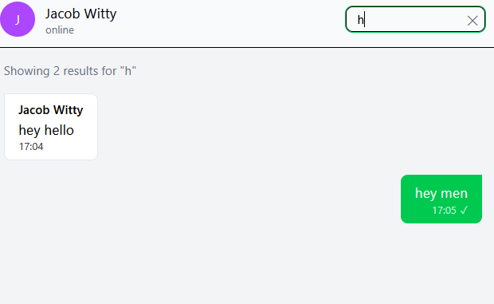
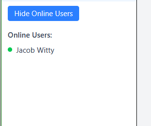
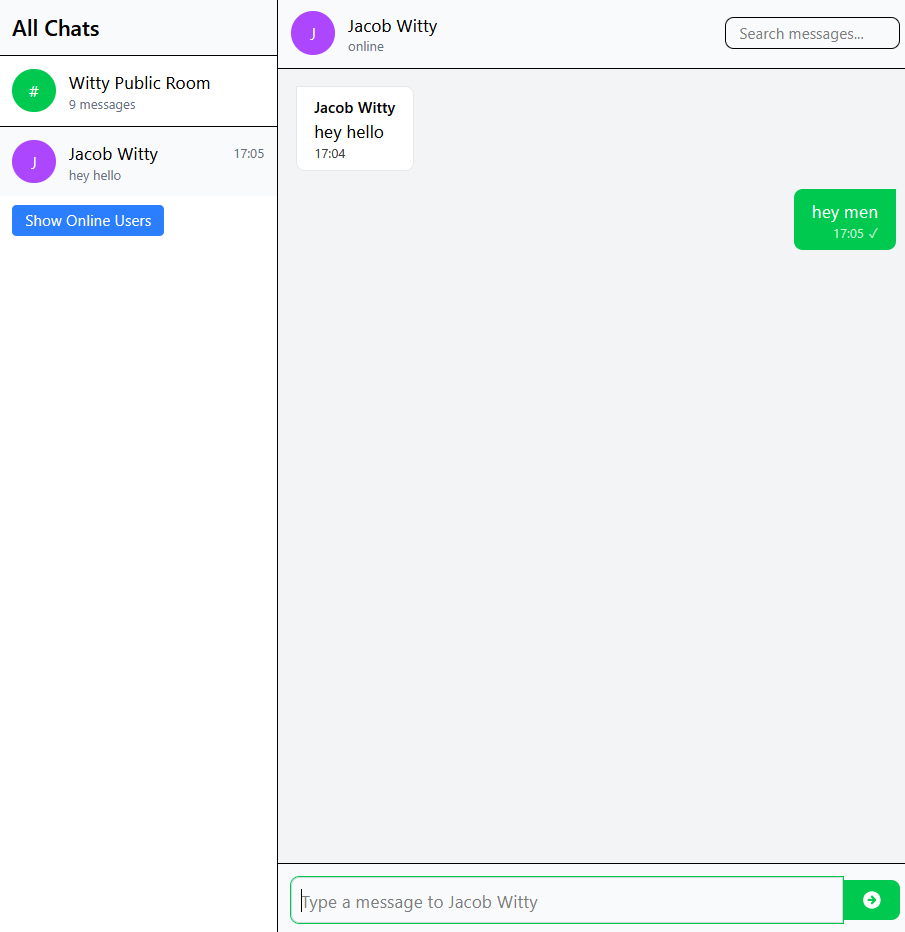
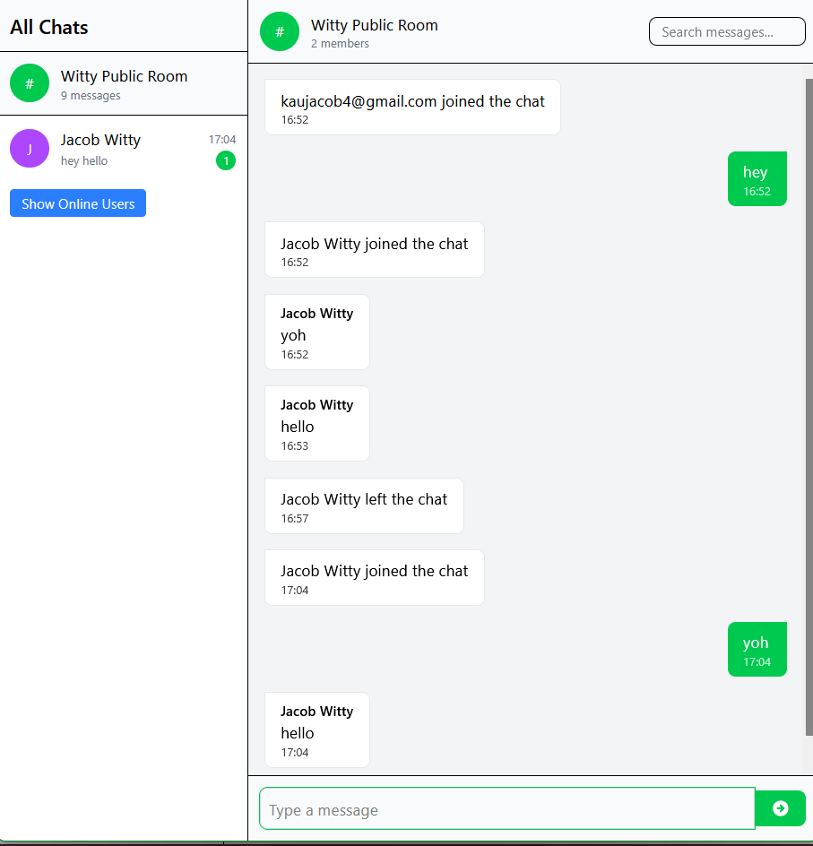
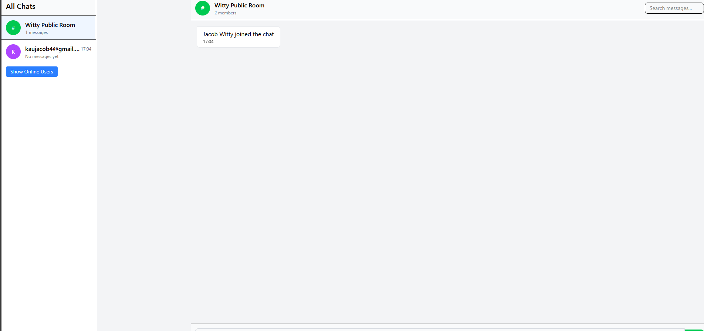
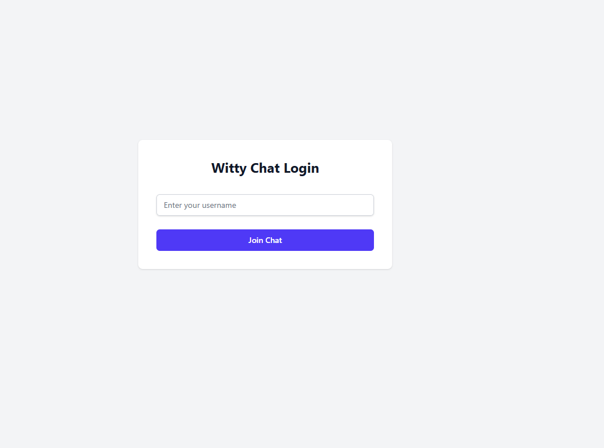

# 🟢 Witty Chat – Real-time WebSocket Chat Application

A modern, full-stack real-time chat app built using **React**, **Socket.IO**, and **Node.js**, with support for public and private messaging, typing indicators, unread message tracking, and more.

 

---

## 📌 Project Overview

**Witty Chat** allows multiple users to connect in real-time, send messages, and interact in a sleek, responsive UI. The app supports:

- Public chatroom for all connected users
- Private 1-on-1 chats
- Real-time typing indicators
- Unread message counters
- Online users tracking
- Touch gesture support for mobile sidebar navigation
- Searchable message history

---

## ⚙️ Setup Instructions

### 🔽 Prerequisites
- Node.js and npm installed
- Git installed

### 🔧 Clone the Repository

```bash
git clone https://github.com/your-username/witty-chat.git
cd witty-chat
```

### 📁 Directory Structure

```
client/       → React frontend (Vite)
server/       → Express + Socket.IO backend
```

### 🚀 Setup Client

```bash
cd client
npm install
npm run dev
```

### 🚀 Setup Server

```bash
cd server
npm install
node server.js
```

### 🌐 Access the app
Visit [http://localhost:5173](http://localhost:5173) in your browser.

---

## ✨ Features Implemented

- ✅ **User authentication** (via `useAuth`)
- ✅ **Public and private chat rooms**
- ✅ **Real-time messaging via Socket.IO**
- ✅ **Typing indicators**
- ✅ **Unread message counters**
- ✅ **Mobile touch gestures** (swipe to toggle sidebar)
- ✅ **Search bar for message filtering**
- ✅ **Message read receipts (✓, ✓✓)**
- ✅ **Online user list with dynamic toggle**
- ✅ **Responsive design using TailwindCSS**

---

## 📁 Project Structure

```
client/
├── assets/              → Static assets (audio, icons)
├── components/          → Reusable UI components
├── context/             → React context for auth management
├── hooks/               → Custom hooks (e.g., useAuth)
├── pages/               → App views like ChatPage, LoginPage
├── socket/              → Socket logic and context
├── App.jsx              → App entry
├── main.jsx             → React root
├── routes.jsx           → Routing configuration
└── ...
server/
├── controllers/         → Chat message controller logic
├── server.js            → Socket.IO and Express setup
└── ...
```

---

## 🖼️ Screenshots


 
 
 
 
 
 

---

## 📄 License

MIT License – feel free to use and adapt!

---

## 🙌 Credits

Created by [Jacob Kau](https://github.com/jacobkau) as part of a web sockets assignment project.
